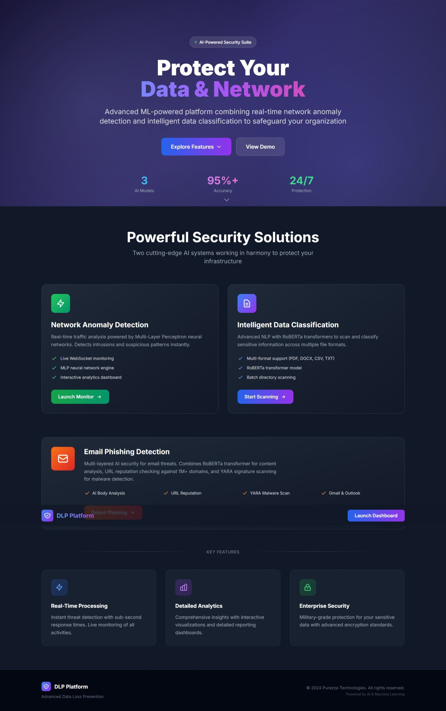
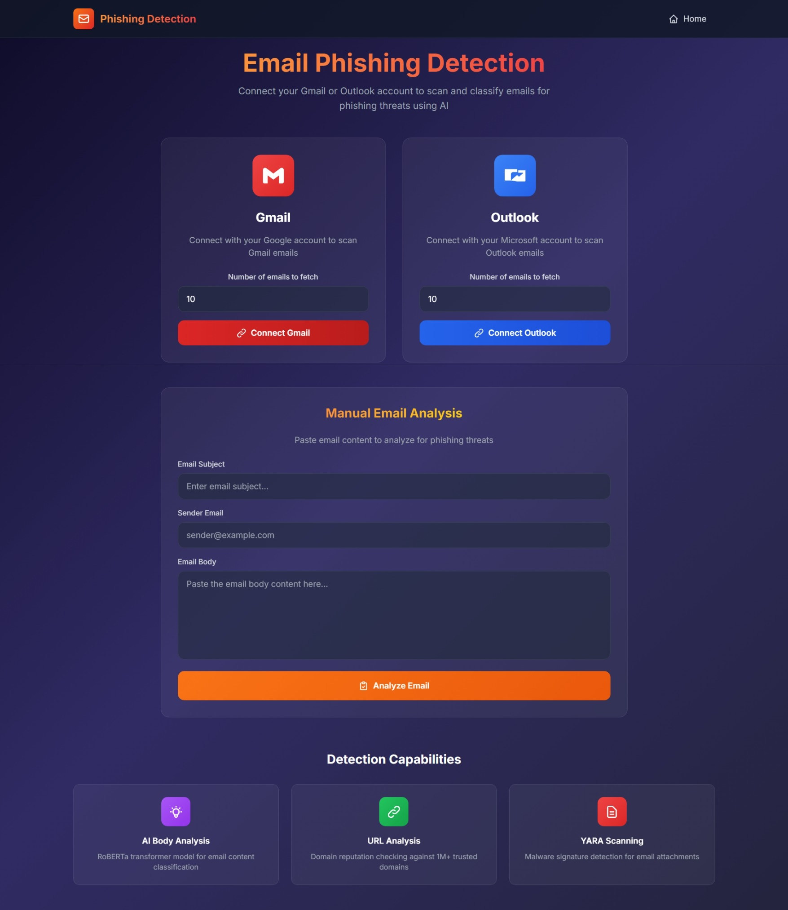
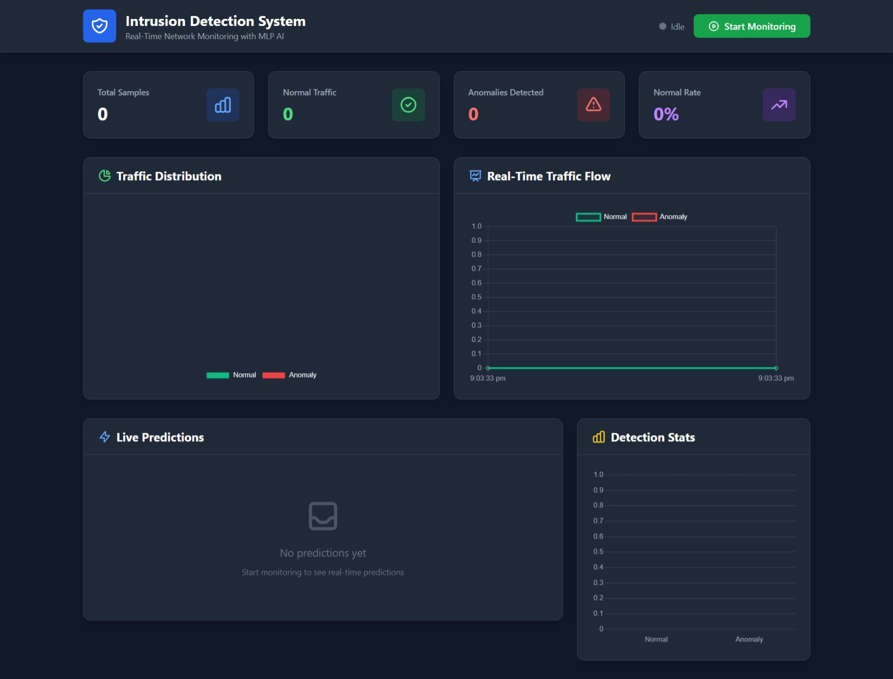
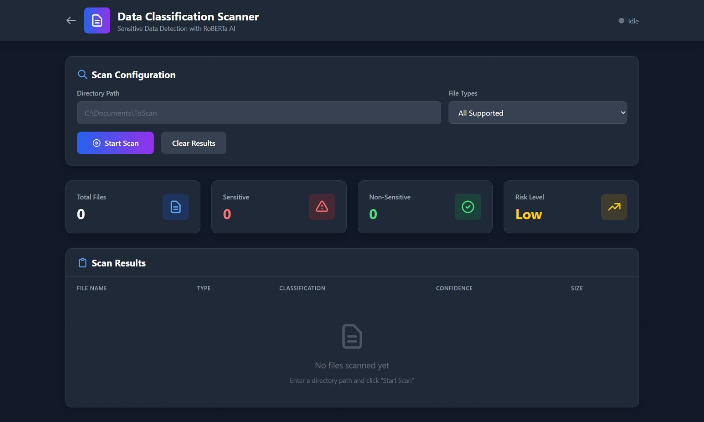

# 🛡️ Unified Data Loss Prevention (DLP) System

A comprehensive **enterprise-grade cybersecurity platform** that combines **7 security modules** into a single unified web application — protecting organizations from phishing attacks, network intrusions, data leakage, malware, and unauthorized file access.


---

## 📋 Table of Contents

- [Overview](#overview)
- [Features](#features)
- [System Architecture](#system-architecture)
- [Tech Stack](#tech-stack)
- [Project Structure](#project-structure)
- [Installation](#installation)
- [Configuration](#configuration)
- [Usage](#usage)
- [How It Works](#how-it-works)
- [Models & Training](#models--training)
- [API Endpoints](#api-endpoints)
- [Screenshots](#screenshots)
- [Future Improvements](#future-improvements)
- [Author](#author)
- [License](#license)

---

## 🎯 Overview

This project is a **unified Data Loss Prevention (DLP) system** that protects organizations from multiple security threats:

| # | Module | Description |
|---|--------|-------------|
| 1 | **Phishing Email Detection** | AI-powered email analysis with Gmail/Outlook integration |
| 2 | **Network Anomaly Detection (IDS)** | Real-time network traffic monitoring and intrusion detection |
| 3 | **Sensitive Data Classification** | ML-based file scanning to prevent data leakage |
| 4 | **File Monitoring System** | Windows file system activity tracking (delete, rename, restore) |
| 5 | **Malware Analysis** | VirusTotal API integration for threat intelligence |
| 6 | **Agentic RAG AI System** | Intelligent security assistant powered by LLMs |
| 7 | **File Encryption/Decryption** | Secure file protection with encryption capabilities |

Built as a web application with real-time monitoring capabilities, this system provides a **comprehensive security solution** for modern organizations.

**Note** | Only 3 projects are available for now. I am working on integrating the rest of the projects.

---

## ✨ Features

### 🎣 Phishing Email Detection
- **Gmail & Outlook Integration** — OAuth 2.0 authentication for secure email access
- **AI-Powered Classification** — RoBERTa + LoRA fine-tuned model for text analysis
- **URL Analysis** — Checks links against 1M+ trusted domains database
- **Attachment Scanning** — YARA rules for malware detection + CNN for image classification
- **Multi-Factor Scoring** — Weighted analysis combining 5 different risk factors
- **Document Sensitivity** — Classifies PDF, DOCX, CSV, Excel attachments
- **Real-time Dashboard** — View analyzed emails with confidence scores

### 🔍 Network Anomaly Detection (IDS)
- **Live Packet Capture** — Real-time network monitoring using Scapy
- **Traffic Generation** — Built-in traffic simulator for testing
- **MLP Classifier** — Machine learning model trained on network flow features
- **Real-time Predictions** — Socket.IO powered live updates
- **Statistics Dashboard** — Visual representation of normal vs anomaly traffic

### 📁 Data Classification Scanner
- **Multi-Format Support** — TXT, DOCX, PDF, CSV, XLSX, XLS files
- **RoBERTa Classification** — Deep learning model for text sensitivity analysis
- **Majority Voting** — Handles long documents by analyzing sentence chunks
- **Directory Scanning** — Recursive file system scanning
- **Progress Tracking** — Real-time scan progress with Socket.IO

### 👁️ File Monitoring System (Windows)
- **Real-time Tracking** — Monitors file system events as they happen
- **Action Detection** — Tracks create, delete, rename, modify, and restore operations
- **Windows Integration** — Uses Windows API for native file system monitoring
- **Activity Logging** — Maintains detailed logs of all file operations
- **Alert System** — Notifications for suspicious file activities

### 🦠 Malware Analysis
- **VirusTotal Integration** — Leverages VirusTotal API for comprehensive threat analysis
- **Multi-Engine Scanning** — Results from 70+ antivirus engines
- **File Hash Analysis** — Quick lookup using SHA256/MD5 hashes
- **Detailed Reports** — Comprehensive malware analysis reports
- **Threat Intelligence** — Community-driven threat data

### 🤖 Agentic RAG AI System
- **LLM-Powered Assistant** — Intelligent security analysis using Large Language Models
- **RAG Architecture** — Retrieval-Augmented Generation for accurate responses
- **Context-Aware** — Understands security context and provides relevant insights
- **Query Interface** — Natural language interface for security queries
- **Knowledge Base** — Built-in security knowledge for informed responses

### 🔐 File Encryption/Decryption
- **AES Encryption** — Industry-standard encryption algorithms
- **Secure Key Management** — Safe handling of encryption keys
- **Batch Processing** — Encrypt/decrypt multiple files at once
- **Format Preservation** — Maintains file structure after decryption
- **Password Protection** — Optional password-based encryption

---

## 🏗️ System Architecture

```
┌──────────────────────────────────────────────────────────────────────────────────┐
│                              Web Interface (Flask + Socket.IO)                    │
├──────────────────────────────────────────────────────────────────────────────────┤
│                                                                                   │
│  ┌─────────────┐ ┌─────────────┐ ┌─────────────┐ ┌─────────────┐ ┌─────────────┐ │
│  │  Phishing   │ │  Network    │ │    Data     │ │    File     │ │   Malware   │ │
│  │  Detection  │ │    IDS      │ │Classification│ │  Monitoring │ │  Analysis   │ │
│  └──────┬──────┘ └──────┬──────┘ └──────┬──────┘ └──────┬──────┘ └──────┬──────┘ │
│         │               │               │               │               │        │
│  ┌──────▼──────┐ ┌──────▼──────┐ ┌──────▼──────┐ ┌──────▼──────┐ ┌──────▼──────┐ │
│  │RoBERTa+LoRA │ │  MLP Model  │ │  RoBERTa    │ │ Windows API │ │ VirusTotal  │ │
│  │+CNN+YARA    │ │  (Anomaly)  │ │ Classifier  │ │ FileSystem  │ │    API      │ │
│  └─────────────┘ └─────────────┘ └─────────────┘ └─────────────┘ └─────────────┘ │
│                                                                                   │
│  ┌─────────────────────────────────┐ ┌─────────────────────────────────────────┐ │
│  │      🤖 Agentic RAG AI          │ │         🔐 File Encryption              │ │
│  │  ┌─────────┐    ┌─────────┐     │ │    ┌──────────┐    ┌──────────┐        │ │
│  │  │   LLM   │◄──►│  RAG    │     │ │    │   AES    │    │   Key    │        │ │
│  │  │ (Groq)  │    │ Engine  │     │ │    │ Encrypt  │    │ Manager  │        │ │
│  │  └─────────┘    └─────────┘     │ │    └──────────┘    └──────────┘        │ │
│  └─────────────────────────────────┘ └─────────────────────────────────────────┘ │
│                                                                                   │
├──────────────────────────────────────────────────────────────────────────────────┤
│                    SQLite Databases + Vector Store (ChromaDB)                     │
│            (phishing_emails.db, feedback.db, file_monitor.db, vectors)            │
└──────────────────────────────────────────────────────────────────────────────────┘
```

---

## 🛠️ Tech Stack

| Category | Technologies |
|----------|-------------|
| **Backend** | Python, Flask, Flask-SocketIO, SQLite |
| **ML/AI** | PyTorch, Transformers (RoBERTa), TensorFlow/Keras, scikit-learn, PEFT (LoRA) |
| **NLP** | HuggingFace Transformers, NLTK, langdetect |
| **LLM/RAG** | LangChain, ChromaDB, Groq API, Sentence Transformers |
| **Computer Vision** | TensorFlow, Pillow |
| **Network Analysis** | Scapy, pandas |
| **Security** | YARA, OAuth 2.0, cryptography (AES) |
| **APIs** | Gmail API, Microsoft Graph API, VirusTotal API, Groq API |
| **File System** | watchdog, Windows API (pywin32) |
| **Frontend** | HTML, CSS, JavaScript, Socket.IO Client |
| **Document Processing** | PyPDF2, python-docx, openpyxl |

---

## 📂 Project Structure

```
Deploying DLP/
│
├── app.py                              # Main Flask application (~2500+ lines)
│
├── # ─────── PHISHING DETECTION MODULE ───────
├── body_classifier.py                  # RoBERTa + LoRA phishing body classifier
├── phishing_document_classifier.py     # Document attachment classifier
├── roberta_lora_phishing_detector.pt   # Fine-tuned RoBERTa model (~503MB)
├── image_model.h5                      # CNN for image classification (~82MB)
├── top-1m.csv                          # Trusted domains database (1M+ domains)
├── awesome-yara/                       # YARA rules collection
│   └── rules/                          # Malware detection rules
│
├── # ─────── NETWORK IDS MODULE ───────
├── monitor.py                          # Scapy packet capture & feature extraction
├── traffic.py                          # Traffic generator for testing
├── mlp_ids_model.pkl                   # MLP anomaly detection model
├── scaler.pkl                          # Feature scaler
├── label_encoders.pkl                  # Categorical encoders
├── feature_info.pkl                    # Feature metadata
│
├── # ─────── DATA CLASSIFICATION MODULE ───────
├── data_classifier.py                  # RoBERTa file sensitivity classifier
├── Data Classification File and Model/ # Training data & model files
│
├── # ─────── FILE MONITORING MODULE (Windows) ───────
├── file_monitor.py                     # Windows file system event monitor
├── file_monitor.db                     # SQLite database for file events
│
├── # ─────── MALWARE ANALYSIS MODULE ───────
├── malware_analyzer.py                 # VirusTotal API integration
├── virustotal_cache.db                 # Cache for API responses
│
├── # ─────── AGENTIC RAG AI MODULE ───────
├── rag_agent.py                        # LLM-powered security assistant
├── knowledge_base/                     # Security knowledge documents
├── vector_store/                       # ChromaDB vector embeddings
│
├── # ─────── FILE ENCRYPTION MODULE ───────
├── file_encryption.py                  # AES encryption/decryption utilities
├── key_manager.py                      # Secure key management
│
├── # ─────── WEB INTERFACE ───────
├── template/                           # HTML templates
│   ├── index.html                      # Landing page
│   ├── anomaly_detection.html          # Network IDS dashboard
│   ├── data_classification.html        # File scanner interface
│   ├── phishing_detection.html         # Email analysis interface
│   ├── phishing_dashboard.html         # Email results dashboard
│   ├── email_details.html              # Individual email view
│   ├── file_monitor.html               # File monitoring dashboard
│   ├── malware_analysis.html           # Malware analysis interface
│   ├── rag_assistant.html              # AI assistant chat interface
│   └── encryption.html                 # File encryption interface
│
├── # ─────── CONFIGURATION ───────
├── requirements.txt                    # Python dependencies
├── .env                                # Environment variables (not in repo)
└── README.md                           # This file
```

---

## 🚀 Installation

### Prerequisites

- Python 3.8 or higher
- pip (Python package manager)
- Git
- Administrator privileges (for network packet capture)

### Step 1: Clone the Repository

```bash
git clone https://github.com/yourusername/dlp-system.git
cd dlp-system
```

### Step 2: Create Virtual Environment

```bash
python -m venv venv

# Windows
venv\Scripts\activate

# Linux/Mac
source venv/bin/activate
```

### Step 3: Install Dependencies

```bash
pip install -r requirements.txt
```

### Step 4: Download NLTK Data

```python
import nltk
nltk.download('punkt')
nltk.download('punkt_tab')
```

### Step 5: Install Npcap (Windows) or libpcap (Linux)

For network packet capture functionality:

**Windows:**
- Download and install [Npcap](https://npcap.com/#download)
- During installation, check "Install Npcap in WinPcap API-compatible Mode"

**Linux:**
```bash
sudo apt-get install libpcap-dev
```

---

## ⚙️ Configuration

### Environment Variables

Create a `.env` file or set the following environment variables:

```bash
# Google Gmail API Credentials
GOOGLE_CLIENT_ID=your_google_client_id
GOOGLE_CLIENT_SECRET=your_google_client_secret
GOOGLE_REDIRECT_URI=http://127.0.0.1:5000/phishing/callback

# Microsoft Outlook API Credentials
OUTLOOK_CLIENT_ID=your_outlook_client_id
OUTLOOK_CLIENT_SECRET=your_outlook_client_secret
OUTLOOK_REDIRECT_URI=http://localhost:5000/phishing/callback_outlook

# VirusTotal API (for Malware Analysis)
VIRUSTOTAL_API_KEY=your_virustotal_api_key

# Groq API (for Agentic RAG AI)
GROQ_API_KEY=your_groq_api_key

# Encryption Settings
ENCRYPTION_KEY=your_secure_encryption_key
```

### Setting Environment Variables

**Windows (PowerShell):**
```powershell
setx GOOGLE_CLIENT_ID "your_client_id"
setx GOOGLE_CLIENT_SECRET "your_client_secret"
setx OUTLOOK_CLIENT_ID "your_outlook_client_id"
setx OUTLOOK_CLIENT_SECRET "your_outlook_client_secret"
```

**Windows (Command Prompt):**
```cmd
set GOOGLE_CLIENT_ID=your_client_id
set GOOGLE_CLIENT_SECRET=your_client_secret
```

**Linux/Mac:**
```bash
export GOOGLE_CLIENT_ID="your_client_id"
export GOOGLE_CLIENT_SECRET="your_client_secret"
```

### Obtaining API Credentials

#### Gmail API:
1. Go to [Google Cloud Console](https://console.cloud.google.com/)
2. Create a new project
3. Enable Gmail API
4. Create OAuth 2.0 credentials
5. Add authorized redirect URI: `http://127.0.0.1:5000/phishing/callback`

#### Outlook API:
1. Go to [Azure Portal](https://portal.azure.com/)
2. Register a new application in Azure AD
3. Add API permissions for Microsoft Graph (Mail.Read)
4. Create a client secret
5. Add redirect URI: `http://localhost:5000/phishing/callback_outlook`

---

## 📖 Usage

### Starting the Application

```bash
python app.py
```

The application will start at `http://127.0.0.1:5000`

---

### Module 1: Phishing Email Detection

1. Navigate to **Phishing Detection** from the home page
2. Choose your email provider (Gmail or Outlook)
3. Select the number of emails to analyze
4. Click **Connect & Analyze**
5. Authorize the application via OAuth
6. View results on the dashboard

**Manual Analysis:**
- Paste email content directly into the text area
- Click **Analyze** to get instant results

---

### Module 2: Network Anomaly Detection

1. Navigate to **Anomaly Detection** from the home page
2. Click **Start Monitoring**
   - This starts the traffic generator
   - Begins packet capture
   - Runs real-time ML predictions
3. Watch real-time predictions appear on the dashboard
4. Click **Stop Monitoring** to end the session

> ⚠️ **Note:** Run with administrator privileges for packet capture to work.

---

### Module 3: Data Classification Scanner

1. Navigate to **Data Classification** from the home page
2. Enter the directory path to scan
3. Click **Start Scan**
4. Watch files being classified in real-time
5. View results with sensitivity labels and confidence scores

**Supported File Types:**
- `.txt` — Plain text files
- `.pdf` — PDF documents
- `.docx` — Word documents
- `.csv` — CSV files
- `.xlsx` / `.xls` — Excel spreadsheets

---

### Module 4: File Monitoring System (Windows)

1. Navigate to **File Monitoring** from the home page
2. Enter the directory path to monitor
3. Click **Start Monitoring**
4. The system will track all file operations in real-time:
   - **Created** — New files added
   - **Deleted** — Files removed
   - **Modified** — File content changes
   - **Renamed** — File name changes
   - **Restored** — Files recovered from recycle bin
5. View activity logs with timestamps
6. Click **Stop Monitoring** to end the session

> ⚠️ **Note:** This module is Windows-only and requires appropriate file system permissions.

---

### Module 5: Malware Analysis

1. Navigate to **Malware Analysis** from the home page
2. Upload a file or enter a file hash (SHA256/MD5)
3. Click **Analyze**
4. View comprehensive results from VirusTotal:
   - Detection ratio (e.g., 5/70 engines detected)
   - Individual antivirus results
   - File metadata and properties
   - Community reputation score
5. Download detailed report if needed

---

### Module 6: Agentic RAG AI Assistant

1. Navigate to **AI Assistant** from the home page
2. Type your security-related query in natural language
3. Examples:
   - "What are the signs of a phishing email?"
   - "Explain the latest ransomware trends"
   - "How do I secure my network against DDoS?"
   - "Analyze this suspicious URL pattern"
4. The AI uses RAG to provide accurate, context-aware responses
5. View sources and references for each answer

---

### Module 7: File Encryption/Decryption

1. Navigate to **Encryption** from the home page
2. **To Encrypt:**
   - Select file(s) to encrypt
   - Enter a strong password
   - Click **Encrypt**
   - Download encrypted file (.enc)
3. **To Decrypt:**
   - Upload encrypted file
   - Enter the correct password
   - Click **Decrypt**
   - Download original file

---

## 🔬 How It Works

### Phishing Detection Pipeline

```
Email Input
    │
    ▼
┌─────────────────────────────────────────────────────────────┐
│ 1. WHITELIST CHECK                                          │
│    - Check sender against trusted domains (top-1m.csv)      │
│    - If trusted → Mark as SAFE                              │
└─────────────────────────────────────────────────────────────┘
    │
    ▼
┌─────────────────────────────────────────────────────────────┐
│ 2. LANGUAGE DETECTION                                        │
│    - Detect email language                                   │
│    - Non-English → Mark for review                          │
└─────────────────────────────────────────────────────────────┘
    │
    ▼
┌─────────────────────────────────────────────────────────────┐
│ 3. AI BODY ANALYSIS (40% weight)                            │
│    - RoBERTa + LoRA model inference                         │
│    - Returns phishing probability                           │
└─────────────────────────────────────────────────────────────┘
    │
    ▼
┌─────────────────────────────────────────────────────────────┐
│ 4. URL ANALYSIS (25% weight)                                │
│    - Extract all URLs from email                            │
│    - Check against trusted domains                          │
│    - Flag suspicious domains                                │
└─────────────────────────────────────────────────────────────┘
    │
    ▼
┌─────────────────────────────────────────────────────────────┐
│ 5. ATTACHMENT ANALYSIS (15% weight)                         │
│    - YARA rules scan for malware                            │
│    - CNN classification for images                          │
│    - RoBERTa for document content                           │
└─────────────────────────────────────────────────────────────┘
    │
    ▼
┌─────────────────────────────────────────────────────────────┐
│ 6. CONTENT HEURISTICS (10% weight)                          │
│    - Check for suspicious keywords                          │
│    - "urgent", "verify", "password", etc.                   │
└─────────────────────────────────────────────────────────────┘
    │
    ▼
┌─────────────────────────────────────────────────────────────┐
│ 7. SENDER TRUST (10% weight)                                │
│    - Check for suspicious TLDs                              │
│    - .xyz, .biz, .click, etc.                               │
└─────────────────────────────────────────────────────────────┘
    │
    ▼
┌─────────────────────────────────────────────────────────────┐
│ 8. FINAL CLASSIFICATION                                      │
│    - Weighted score calculation                              │
│    - Thresholds: Safe (≥90%), Phishing (≥35%)               │
│    - Generate explanation                                    │
└─────────────────────────────────────────────────────────────┘
    │
    ▼
 Result: SAFE / PHISHING / NEEDS REVIEW (with confidence %)
```

---

### Network IDS Pipeline

```
Network Interface
    │
    ▼
┌─────────────────────────────────────────────────────────────┐
│ 1. PACKET CAPTURE (Scapy)                                   │
│    - Sniff IP, TCP, UDP, ICMP packets                       │
│    - Extract connection 5-tuple                             │
└─────────────────────────────────────────────────────────────┘
    │
    ▼
┌─────────────────────────────────────────────────────────────┐
│ 2. FEATURE EXTRACTION (18 features)                         │
│    - duration, protocol_type, service, flag                 │
│    - src_bytes, dst_bytes                                   │
│    - count, srv_count, same_srv_rate, diff_srv_rate        │
│    - serror_rate, rerror_rate                               │
│    - dst_host_count, dst_host_srv_count                     │
│    - dst_host_same_srv_rate, dst_host_diff_srv_rate        │
│    - dst_host_serror_rate, dst_host_rerror_rate            │
└─────────────────────────────────────────────────────────────┘
    │
    ▼
┌─────────────────────────────────────────────────────────────┐
│ 3. PREPROCESSING                                             │
│    - Encode categorical features (protocol, service, flag)  │
│    - Scale numerical features (StandardScaler)              │
└─────────────────────────────────────────────────────────────┘
    │
    ▼
┌─────────────────────────────────────────────────────────────┐
│ 4. MLP CLASSIFICATION                                        │
│    - Multi-Layer Perceptron prediction                      │
│    - Probability scores for Normal/Anomaly                  │
└─────────────────────────────────────────────────────────────┘
    │
    ▼
 Real-time Result: NORMAL / ANOMALY (with confidence %)
```

---

### Data Classification Pipeline

```
File/Directory Input
    │
    ▼
┌─────────────────────────────────────────────────────────────┐
│ 1. FILE DISCOVERY                                            │
│    - Scan directory for supported extensions                │
│    - Filter: .txt, .pdf, .docx, .csv, .xlsx, .xls          │
└─────────────────────────────────────────────────────────────┘
    │
    ▼
┌─────────────────────────────────────────────────────────────┐
│ 2. TEXT EXTRACTION                                           │
│    - PDF → PyPDF2                                           │
│    - DOCX → python-docx                                     │
│    - Excel → openpyxl/pandas                                │
│    - CSV → pandas with encoding detection                   │
└─────────────────────────────────────────────────────────────┘
    │
    ▼
┌─────────────────────────────────────────────────────────────┐
│ 3. TEXT PREPROCESSING                                        │
│    - For tabular data: Generate descriptive sentences       │
│    - For long docs: Split into sentence chunks              │
└─────────────────────────────────────────────────────────────┘
    │
    ▼
┌─────────────────────────────────────────────────────────────┐
│ 4. ROBERTA CLASSIFICATION                                    │
│    - Tokenize text (max 512 tokens)                         │
│    - Run through RoBERTa + LoRA model                       │
│    - For long docs: Majority voting across chunks           │
└─────────────────────────────────────────────────────────────┘
    │
    ▼
 Result: SENSITIVE / NON-SENSITIVE (with confidence %)
```

---

## 🧠 Models & Training

### 1. Phishing Email Body Classifier

| Attribute | Value |
|-----------|-------|
| Base Model | `FacebookAI/roberta-base` |
| Fine-tuning | LoRA (Low-Rank Adaptation) |
| Parameters | r=16, alpha=32, dropout=0.1 |
| Target Modules | query, value |
| Output | Binary (Safe/Phishing) |
| Model Size | ~503 MB |

### 2. Network Anomaly Detection Model

| Attribute | Value |
|-----------|-------|
| Model Type | Multi-Layer Perceptron (MLP) |
| Features | 18 network flow features |
| Training Data | KDD Cup-style features |
| Output | Binary (Normal/Anomaly) |
| Preprocessing | StandardScaler + LabelEncoders |

### 3. Image Attachment Classifier

| Attribute | Value |
|-----------|-------|
| Model Type | Convolutional Neural Network (CNN) |
| Framework | TensorFlow/Keras |
| Input Size | 148x148 RGB |
| Output | Binary (Sensitive/Non-Sensitive) |
| Model Size | ~82 MB |

### 4. Data Classification Model

| Attribute | Value |
|-----------|-------|
| Base Model | `FacebookAI/roberta-base` |
| Fine-tuning | LoRA |
| Strategy | Majority voting for long documents |
| Output | Binary (Sensitive/Non-Sensitive) |

---

## 🔌 API Endpoints

### General

| Method | Endpoint | Description |
|--------|----------|-------------|
| GET | `/` | Landing page |
| GET | `/anomaly-detection` | Network IDS dashboard |
| GET | `/data-classification` | File scanner page |
| GET | `/phishing-detection` | Phishing analysis page |

### Network Anomaly Detection

| Method | Endpoint | Description |
|--------|----------|-------------|
| POST | `/api/start` | Start monitoring |
| POST | `/api/stop` | Stop monitoring |
| GET | `/api/stats` | Get detection statistics |
| GET | `/api/recent` | Get recent predictions |

### Data Classification

| Method | Endpoint | Description |
|--------|----------|-------------|
| POST | `/api/classify/start` | Start directory scan |
| POST | `/api/classify/stop` | Stop scanning |
| GET | `/api/classify/stats` | Get classification stats |
| GET | `/api/classify/results` | Get classification results |

### Phishing Detection

| Method | Endpoint | Description |
|--------|----------|-------------|
| POST | `/api/phishing/analyze` | Analyze email content manually |
| GET | `/api/phishing/stats` | Get phishing statistics |
| GET | `/phishing/authorize_gmail` | Start Gmail OAuth |
| GET | `/phishing/authorize_outlook` | Start Outlook OAuth |
| GET | `/phishing/dashboard` | View analyzed emails |

### File Monitoring

| Method | Endpoint | Description |
|--------|----------|-------------|
| POST | `/api/monitor/start` | Start file monitoring |
| POST | `/api/monitor/stop` | Stop file monitoring |
| GET | `/api/monitor/events` | Get recent file events |
| GET | `/api/monitor/stats` | Get monitoring statistics |

### Malware Analysis

| Method | Endpoint | Description |
|--------|----------|-------------|
| POST | `/api/malware/scan` | Scan file for malware |
| POST | `/api/malware/hash` | Lookup file by hash |
| GET | `/api/malware/report/{id}` | Get analysis report |

### RAG AI Assistant

| Method | Endpoint | Description |
|--------|----------|-------------|
| POST | `/api/rag/query` | Submit query to AI |
| GET | `/api/rag/history` | Get conversation history |
| POST | `/api/rag/feedback` | Submit response feedback |

### File Encryption

| Method | Endpoint | Description |
|--------|----------|-------------|
| POST | `/api/encrypt` | Encrypt file(s) |
| POST | `/api/decrypt` | Decrypt file(s) |
| POST | `/api/encrypt/batch` | Batch encryption |

---

## 📸 Screenshots


### Landing Page


### Phishing Detection Dashboard


### Network Anomaly Detection


### Data Classification Scanner


---


## 👨‍💻 Author

**[Ayush Gupta]**

- B.Tech AI & ML Student (2nd Year, 3rd Semester)
- GitHub: [@AyushGupta1332](https://github.com/AyushGupta1332)
- LinkedIn: [Ayush Raj](https://www.linkedin.com/in/ayush-raj-144b2325a/)

---

## 📄 License

This project is licensed under the MIT License - see the [LICENSE](LICENSE) file for details.

---

## 🙏 Acknowledgments

- [HuggingFace Transformers](https://huggingface.co/transformers/) for RoBERTa models
- [PEFT Library](https://github.com/huggingface/peft) for LoRA implementation
- [Awesome YARA](https://github.com/InQuest/awesome-yara) for YARA rules
- [Scapy](https://scapy.net/) for packet manipulation
- [Flask-SocketIO](https://flask-socketio.readthedocs.io/) for real-time communication
- [VirusTotal](https://www.virustotal.com/) for malware intelligence API
- [LangChain](https://langchain.com/) for RAG implementation
- [ChromaDB](https://www.trychroma.com/) for vector storage
- [Groq](https://groq.com/) for LLM inference
- [Cryptography](https://cryptography.io/) for encryption utilities

---

